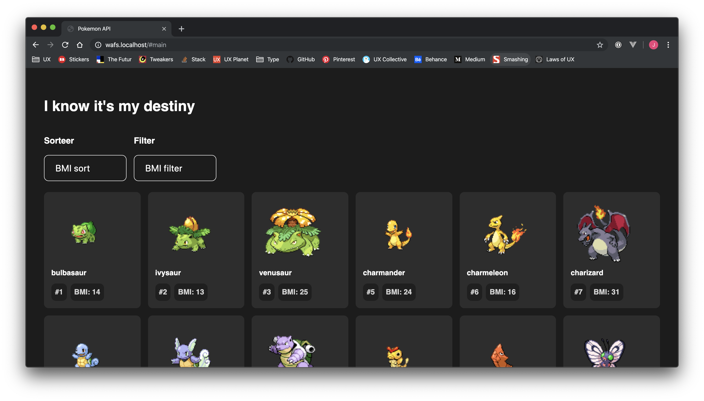

# Web App From Scratch @cmda-minor-web 1819
Ook ik heb erg origineel (not) voor de [pokéAPI](https://pokeapi.co/) gekozen voor deze opdracht. Ik heb voor het eerst geleerd om zelf javascript templates te maken en object literals te gebruiken.

Object literals zorgen voor meer structuur en een duidelijke scheiding tussen functionaliteiten. Zo blijft de code schoon en wordt de global scope niet onnodig vervuild.

In de code vind je relatief nieuwe methodes zoals template literals, promises en async functions. Om de juiste pokemonData op te halen is het nodig om meerdere requests te doen. Om te voorkomen dat er timing issues ontstaan, is het extra belangrijk eerst de data op te halen. Met veel pijn en moeite ben ik achter `await` gekomen.

[Je vindt de app hier!](https://jamalvr.github.io/web-app-from-scratch-1819/)

## Dependencies
- routie.js

## Hoe werkt de app?
### Actor Diagram

### Interaction Diagram

